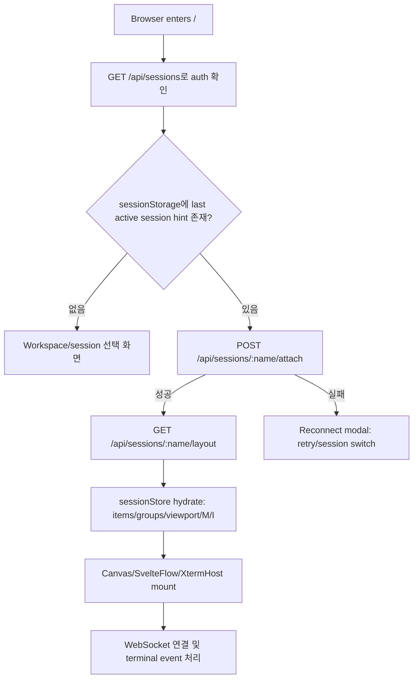

# 0045 — 새로고침 세션 복구 UX 및 Svelte update-depth 루프 분석

- 작성일: 2026-05-16
- 종류: frontend investigation / implementation handoff
- 상태: ✅ **해결 (2026-05-16) — ReconnectModal `$effect` self-loop 가 진짜 root cause**. 본 문서 §11 amend 참조.
- 관련 영역: session attach, reconnect gate, layout hydrate, canvas mount, SvelteFlow node sync
- 관련 코드:
  - `codebase/frontend/src/routes/+page.svelte`
  - `codebase/frontend/src/lib/stores/reconnectGate.svelte.ts`
  - `codebase/frontend/src/lib/stores/sessionStore.svelte.ts`
  - `codebase/frontend/src/lib/canvas/Canvas.svelte`
  - `codebase/frontend/src/lib/canvas/TextNode.svelte`
  - `codebase/frontend/src/lib/canvas/XtermHost.svelte`
  - `codebase/frontend/src/lib/chrome/ReconnectModal.svelte`

## 1. 문제 요약

웹에서 새로고침으로 진입할 때 다음 런타임 오류가 발생한다.

```text
Uncaught Error: https://svelte.dev/e/effect_update_depth_exceeded
```

처음에는 이전 빌드 자산인 `svelteflow-Btuz5yRY.js`에서 오류가 보고되었고, 이후 새 빌드 자산인 `svelteflow-ClVgLoWB.js`에서도 동일 오류가 보고되었다. 따라서 현재 기준으로는 “브라우저가 이전 자산을 캐시해서 생긴 stale asset 문제”가 아니라, 최신 빌드에서도 남아 있는 반응성 루프 문제로 봐야 한다.

중요한 점은 이 문제가 단순히 특정 stack trace 한 줄을 제거하는 문제가 아니라는 것이다. 새로고침은 사용자가 기존 작업 상태로 돌아오는 핵심 UX 흐름이며, session attach, layout hydrate, canvas mount, WebSocket reconnect가 순서 있게 정리되어야 한다.

## 2. 사용자 시나리오 기준 UX

gtmux에서 새로고침은 “빈 앱을 다시 여는 동작”이 아니라 “이전 tmux-backed 작업 세션에 다시 붙는 동작”이다.

정상 UX는 다음과 같아야 한다.

1. 사용자가 이미 인증된 브라우저에서 새로고침한다.
2. 앱은 쿠키 기반 auth를 확인한다.
3. 직전 active session 힌트가 있으면 해당 세션을 복구 대상으로 판단한다.
4. 서버에 session attach를 요청한다.
5. attach 성공 후 서버 layout을 가져온다.
6. layout hydrate가 끝난 뒤에 canvas와 terminal panel을 표시한다.
7. WebSocket은 terminal output, terminal lifecycle event, viewport/layout 관련 event를 이어 받는다.
8. attach 실패 시 canvas를 먼저 보여주지 않고 reconnect modal 또는 session switch 흐름으로 이동한다.

따라서 복구 완료 전에는 canvas가 먼저 mount되어 빈 canvas, 중복 canvas, partially-hydrated canvas를 보여주면 안 된다.

## 3. Session-Web 연결 모델

현재 앱의 session 연결 모델은 다음 역할 분리를 전제로 한다.

### 3.1 서버와 tmux가 소유하는 상태

- session/window/pane lifecycle
- terminal id, title, description 등 tmux 또는 서버가 제공하는 terminal metadata
- terminal process output/input stream
- attach 가능 여부
- session 존재 여부와 in-use 상태

### 3.2 Web이 소유하는 상태

- canvas item geometry
- panel visibility, lock, minimize, maximize
- z-index
- layer/group 표현
- viewport
- note, text, figure, image 등 canvas-only item

Web은 tmux lifecycle을 직접 소유하지 않는다. 반대로 서버/tmux도 canvas 상의 자유 배치 상태를 tmux layout으로 간주하면 안 된다.

### 3.3 새로고침 연결 흐름

새로고침 시 기대되는 흐름은 다음과 같다.



이 흐름에서 `Canvas`는 `G` 이후에만 mount되는 것이 안전하다.

## 4. 현재 관측된 오류의 의미

`effect_update_depth_exceeded`는 Svelte effect 또는 derived chain이 안정 상태에 도달하지 못하고 반복 갱신될 때 발생한다.

stack trace가 `svelteflow-*.js` chunk를 가리킨다고 해서 원인이 반드시 SvelteFlow 내부 버그라는 뜻은 아니다. Vite manual chunk 구성상 Svelte runtime과 SvelteFlow 관련 코드가 같은 chunk로 묶일 수 있으므로, 앱 코드의 effect 루프가 해당 chunk 파일명으로 보일 수 있다.

현재까지 확인된 사실은 다음과 같다.

- 새 빌드 후에도 `svelteflow-ClVgLoWB.js`에서 동일 오류가 보고되었다.
- 따라서 stale asset만으로는 설명되지 않는다.
- `TextNode` 단독 문제로 보기 어렵다.
- refresh/reconnect 시점에 layout hydrate, SvelteFlow node prop, viewport sync, terminal panel resize가 동시에 움직이는 경로를 의심해야 한다.

## 5. 이미 시도된 수정

### 5.1 TextNode 측정 effect 제거

`TextNode.svelte`에서 custom `ResizeObserver + $effect + minTextHeight $state` 경로를 제거하고, font size 기반 `$derived` 값으로 단순화했다.

의도:

- text measurement가 자기 자신을 다시 resize시키는 루프를 제거한다.
- text vertical align 문제와 update-depth 문제를 분리해서 볼 수 있게 한다.

한계:

- 이 수정 후에도 사용자는 동일 오류를 보고했다.
- 따라서 TextNode measurement effect는 원인 후보에서 낮아졌지만, text item이 SvelteFlow node measurement를 자극하는 보조 요인일 가능성은 남아 있다.

### 5.2 Canvas viewport sync guard 추가

`Canvas.svelte`에서 store viewport를 SvelteFlow viewport에 적용할 때 `untrack`과 `applyingStoreViewport` guard를 추가했다.

의도:

- `setViewport`가 `onmove`를 발생시키고, `onmove`가 다시 `sessionStore.updateViewport`를 호출하는 순환을 차단한다.
- 동일하거나 거의 동일한 viewport 값은 store에 다시 쓰지 않도록 한다.

한계:

- 초기 layout hydrate 중 viewport와 nodes가 동시에 바뀌는 상황 전체를 해결하지는 못한다.
- `setViewport` 호출 시점이 SvelteFlow 초기화/측정 사이클과 겹치면 여전히 루프를 만들 수 있다.

### 5.3 `bind:nodes` 제거

`Canvas.svelte`에서 `bind:nodes={internalNodes}`를 제거하고 `nodes={flowNodes}` 형태의 one-way prop으로 변경했다.

의도:

- SvelteFlow 내부 node measurement/position 갱신이 parent store에 즉시 되먹임되는 양방향 루프를 끊는다.

한계:

- `flowNodes = $derived(Array.from(sessionStore.items.values()).map(itemToNode))` 형태는 reactive pass마다 새 배열과 새 node 객체를 만들 수 있다.
- SvelteFlow 입장에서는 실제 의미가 동일해도 prop identity가 계속 바뀌는 것으로 보일 수 있다.
- 이 경우 내부 측정 결과와 parent prop 재생성이 계속 충돌하면서 안정 상태에 도달하지 못할 수 있다.

### 5.4 Reconnect gate에 booting 상태 추가

`reconnectGate.svelte.ts`에 초기 `booting` 상태를 추가하고, `canMountApp`이 `idle` 또는 `success`에서만 true가 되도록 조정했다.

`+page.svelte`에서는 auth 확인과 session hint 판단 전에는 workspace/canvas를 mount하지 않고 boot screen을 보여주도록 했다.

의도:

- session 복구 여부가 결정되기 전 canvas가 먼저 mount되는 UX/반응성 문제를 줄인다.

한계:

- layout hydrate 완료와 canvas mount 사이의 원자성이 아직 충분히 보장되는지 별도 검증이 필요하다.
- `success` 전환 시점이 layout hydrate 완료보다 빠르면 여전히 partial mount가 가능하다.

## 6. 현재 최우선 원인 후보

### P0-A. `flowNodes` identity churn

가장 우선적으로 확인해야 할 후보는 `flowNodes`가 reactive pass마다 새 node 객체를 생성하는 구조다.

문제 가능 경로:

1. `sessionStore.items` 또는 관련 파생 값이 갱신된다.
2. `flowNodes`가 전체 item을 map하면서 새 node array/object를 만든다.
3. SvelteFlow는 node prop 변경으로 판단하고 내부 측정/정렬을 수행한다.
4. 측정 결과 또는 viewport/node internals update가 다시 Svelte effect를 발생시킨다.
5. parent가 다시 새 node 객체를 전달한다.
6. 안정 상태에 도달하지 못하고 update-depth 오류가 발생한다.

해결 방향:

- item id별 node cache를 둔다.
- item의 실제 SvelteFlow 관련 signature가 바뀔 때만 새 node 객체를 생성한다.
- signature에 포함할 최소 필드:
  - `id`
  - `type`
  - `x`, `y`, `w`, `h`
  - `zIndex`
  - `visible`, `locked`, `selected`
  - type별 payload 중 렌더링에 영향을 주는 값
- 의미가 동일한 경우 이전 node object reference를 재사용한다.

### P0-B. 초기 viewport 적용이 reactive loop에 남아 있음

viewport는 복구 중 1회 적용되어야 하는 초기 상태와, 사용자가 움직인 뒤 서버/store에 저장해야 하는 runtime 상태가 다르다.

현재 의심:

- layout hydrate 직후 store viewport가 SvelteFlow에 적용된다.
- SvelteFlow 초기 측정 또는 fit 과정에서 viewport가 다시 변한다.
- 앱이 이를 사용자 이동으로 오인해 store에 다시 쓴다.
- store write가 다시 `setViewport`로 이어진다.

해결 방향:

- 초기 layout viewport 적용은 SvelteFlow mount 후 one-shot으로 처리한다.
- 초기 적용이 끝나기 전 `onmove`는 persist하지 않는다.
- 이후 사용자 gesture에서 발생한 viewport 변경만 `sessionStore.updateViewport`로 반영한다.

### P1-C. `loadLayout()`의 다중 write가 mount 타이밍과 겹침

layout hydrate 중 `items`, `groups`, `viewport`, `M`, `I`, `focusMode` 등이 순차적으로 갱신되면, canvas가 mount된 상태에서는 중간 상태들이 모두 UI에 전달된다.

해결 방향:

- layout hydrate를 하나의 transaction처럼 취급한다.
- hydrate 완료 전에는 canvas를 mount하지 않는다.
- store 내부에서도 가능하면 한 번의 commit으로 UI 관찰 상태를 바꾼다.

### P1-D. `XtermHost` ResizeObserver와 SvelteFlow measurement 상호작용

terminal panel이 포함된 layout에서 `XtermHost`의 `ResizeObserver + fit()`이 SvelteFlow node measurement와 겹치면 resize/update 루프가 증폭될 수 있다.

해결 방향:

- terminal panel이 없는 layout과 있는 layout을 나눠 재현한다.
- `XtermHost` mount를 canvas node 안정화 이후로 지연시키는 실험을 한다.
- `fit()` 호출에 requestAnimationFrame 기반 coalescing과 동일 크기 guard를 둔다.

## 7. 다음 구현 방향

다음 수정은 단일 오류 억제보다 refresh UX state machine을 안정화하는 방향으로 진행해야 한다.

1. `Canvas`의 SvelteFlow node adapter를 안정화한다.
   - id별 node cache를 추가한다.
   - signature가 바뀌지 않으면 기존 node object를 재사용한다.
   - 전체 map 결과도 가능한 한 동일 순서와 참조 안정성을 유지한다.

2. session restore gate를 명확히 분리한다.
   - `booting`: auth/session hint 판정 전
   - `attaching`: session attach 중
   - `hydrating`: layout load 및 store hydrate 중
   - `ready`: canvas mount 가능
   - `failed`: reconnect modal

3. canvas mount 조건을 `ready`로 제한한다.
   - attach 성공만으로 mount하지 않는다.
   - layout hydrate 완료 전에는 mount하지 않는다.

4. 초기 viewport 적용을 one-shot으로 만든다.
   - SvelteFlow initialized 이후 한 번만 적용한다.
   - 초기 적용 중 `onmove` persist를 막는다.
   - 이후 사용자 조작만 store/server 반영 대상으로 본다.

5. instrumentation을 임시로 추가한다.
   - `Canvas` mount count
   - `flowNodes` rebuild count
   - node cache hit/miss count
   - `setViewport` call count
   - `onmove` call count
   - `loadLayout` start/end
   - `XtermHost` resize/fit count

instrumentation은 `localStorage` flag 또는 dev-only flag로 켜고, 기본 사용자 흐름에는 노출하지 않는다.

## 8. 검증 계획

### 8.1 정적 검증

다음 명령은 최신 수정 후 통과한 이력이 있다.

```bash
pnpm --dir codebase/frontend check
pnpm --dir codebase/frontend build
```

최신 빌드 당시 `index-BuiOVaPp.js`가 생성되었고, SvelteFlow chunk는 `svelteflow-ClVgLoWB.js`였다.

단, 로컬 서버 listen이 sandbox 제한으로 차단되어 브라우저 런타임 검증은 수행하지 못했다. 이후 구현자는 실제 앱 서버 또는 허용된 dev server에서 refresh 재현 테스트를 반드시 수행해야 한다.

### 8.2 런타임 검증 케이스

다음 케이스를 모두 확인해야 한다.

1. session hint가 없는 최초 진입
   - canvas가 바로 뜨지 않는다.
   - workspace/session 선택 흐름으로 이동한다.
   - console에 update-depth 오류가 없다.

2. 유효한 session hint가 있는 새로고침
   - attach가 먼저 수행된다.
   - layout hydrate 후 canvas가 한 번만 mount된다.
   - 이전 viewport와 panel 배치가 복구된다.
   - console에 update-depth 오류가 없다.

3. session이 사라진 상태의 새로고침
   - canvas가 partial state로 뜨지 않는다.
   - reconnect modal 또는 session switch 흐름으로 이동한다.

4. session이 in-use 또는 attach 거절 상태인 새로고침
   - canvas가 먼저 뜨지 않는다.
   - retry 가능한 실패 UI가 표시된다.

5. terminal panel이 없는 layout
   - shape/text/note만 있는 canvas에서 update-depth 오류가 없어야 한다.

6. terminal panel이 있는 layout
   - `XtermHost` mount 이후에도 resize/fit 루프가 없어야 한다.

7. text/figure가 포함된 layout
   - text bbox와 text DOM 정합 문제가 악화되지 않아야 한다.
   - figure resize/drag 편집 UX가 기존 개선 상태를 유지해야 한다.

### 8.3 브라우저 확인 기준

브라우저 DevTools 또는 테스트 로그에서 다음을 확인한다.

- 로드된 JS asset hash가 최신 빌드와 일치한다.
- `effect_update_depth_exceeded`가 발생하지 않는다.
- `Canvas` mount count가 refresh당 1회다.
- 초기 restore 중 `flowNodes` rebuild가 폭증하지 않는다.
- 초기 viewport 적용 중 `onmove -> updateViewport -> setViewport` 반복이 없다.
- WebSocket 연결 실패/재시도와 canvas mount가 서로 독립적으로 정리되어 있다.

## 9. 완료 기준

이 이슈는 다음 조건을 만족해야 해결로 볼 수 있다.

- 새로고침 후 기존 session에 자동 복구된다.
- 복구 중 빈 canvas 또는 partial canvas가 먼저 보이지 않는다.
- attach 실패 시 canvas 대신 reconnect/session switch UX가 보인다.
- 최신 빌드 자산에서 `effect_update_depth_exceeded`가 재현되지 않는다.
- text, figure, terminal panel이 함께 있는 layout에서도 재현되지 않는다.
- viewport가 서버/layout 상태와 동기화되되 초기 restore 중 루프를 만들지 않는다.
- 구현 변경으로 기존 text/figure 편집 UX가 후퇴하지 않는다.

## 10. Frontend 구현 에이전트 전달 사항

다음 순서로 작업하는 것이 안전하다.

1. `Canvas.svelte`의 `flowNodes` 생성을 안정 참조 cache 방식으로 바꾼다.
2. `reconnectGate`와 `+page.svelte`의 상태를 `booting/attaching/hydrating/ready/failed`로 분리한다.
3. `loadLayout()` 완료 이전에는 `Canvas`가 mount되지 않도록 보장한다.
4. 초기 viewport 적용을 SvelteFlow initialized 이후 one-shot으로 이동한다.
5. 임시 instrumentation을 추가해 refresh 1회당 mount/rebuild/setViewport/onmove 횟수를 확인한다.
6. terminal 없는 layout과 terminal 있는 layout을 분리해 재현성을 좁힌다.
7. `pnpm --dir codebase/frontend check`, `pnpm --dir codebase/frontend build`, 브라우저 새로고침 테스트를 모두 수행한다.

이번 문제의 핵심은 “SvelteFlow 오류를 없애기”가 아니라 “사용자가 새로고침했을 때 이전 작업 세션으로 안정적으로 돌아가는 UX 계약을 구현하기”다. 따라서 수정은 session restore state machine, layout hydrate 원자성, canvas mount timing, node/viewport sync 안정성을 함께 다뤄야 한다.

---

## 11. 해결 amend (2026-05-16 — 실제 root cause 식별)

### 11.1 진짜 root cause

본 §6 의 P0-A (flowNodes identity churn) / P0-B (viewport one-shot) / P1-C (loadLayout 다중 write) / P1-D (XtermHost ResizeObserver) **모두 진짜 source 가 아니었다**. headless Chrome (puppeteer) 진단 + binary search 격리 (모든 mount 컴포넌트를 하나씩 disable) 로 다음 확정:

**`codebase/frontend/src/lib/chrome/ReconnectModal.svelte` 의 `$effect` self-loop**.

```typescript
// 버그 코드
let visible = $state(false);
let graceTimer: ReturnType<typeof setTimeout> | null = $state(null);  // ← reactive!

$effect(() => {
  if (mode === 'loading' && !visible) {       // ← read visible (dep)
    if (graceTimer !== null) clearTimeout(graceTimer);  // ← read graceTimer (dep)
    graceTimer = setTimeout(() => {            // ← write graceTimer → re-trigger
      graceTimer = null;
      visible = true;
    }, 100);
    return () => { /* cleanup */ };
  }
  if (mode !== 'loading') {
    if (graceTimer !== null) { clearTimeout(graceTimer); graceTimer = null; }
    visible = true;
  }
});
```

**메커니즘**:
- `graceTimer` 가 `$state` 라 effect 의 `read + write` 가 자기 자신 invalidate.
- `visible` 도 read 후 write 패턴이지만 두 번째 run 에서 `!visible` 가 false 라 body skip — 그러나 `graceTimer` 는 매 run 마다 set 되면서 무한 자기-trigger.
- Svelte 5 runtime 이 effect-depth 한계 초과 → throw → 그 reactive flush 의 모든 DOM update abort.

**증상 = boot screen 영구 + console effect-depth**:
1. 새로고침 → hint → reconnectGate.start → state='attaching' → `modalState='loading'` → ReconnectModal mount
2. ReconnectModal 의 $effect 첫 run → graceTimer set → effect 재실행 → graceTimer 재set → … infinite loop → throw
3. 동시에 attemptReattach 가 정상 success → markReady() → state='ready' (snapshot 으로 확인됨)
4. 그러나 reactive flush abort 로 인해 `{#if reconnectGate.canMountApp}` 분기의 DOM update 가 일어나지 않음 — boot screen 의 이전 DOM 그대로
5. 사용자 perception: "Reconnecting…" 영구 + console effect-depth 에러

### 11.2 fix

```typescript
let visible = $state(false);
let graceTimer: ReturnType<typeof setTimeout> | null = null;  // ← plain let

$effect(() => {
  const currentMode = mode;
  const isVisible = untrack(() => visible);  // ← untrack 으로 dep 등록 차단
  if (currentMode === 'loading' && !isVisible) {
    if (graceTimer !== null) clearTimeout(graceTimer);
    graceTimer = setTimeout(() => {
      graceTimer = null;
      visible = true;
    }, 100);
    return () => { /* cleanup */ };
  }
  if (currentMode !== 'loading') {
    if (graceTimer !== null) { clearTimeout(graceTimer); graceTimer = null; }
    visible = true;
  }
});
```

- `graceTimer` 를 plain `let` — effect dep 에서 제외 → self-trigger 차단
- `visible` 의 read 를 `untrack` 으로 wrap → dep 등록 안 됨
- 결과: effect 가 *오직 `mode` prop 변경 시에만* trigger → 안정

### 11.3 §6 후보들의 가치

본 amend 의 실제 source 가 §6 후보 밖이었지만, §6 의 *예방 fix* 자체는 여전히 valid (다음 회귀 차단):
- **P0-A flowNodes id-cache + signature** (Canvas.svelte): SvelteFlow prop identity 안정화 — 향후 layout mutation burst 시 churn 차단
- **P0-B viewport sync untrack + RAF×2** (Canvas.svelte): setViewport ↔ onmove 미세 race 차단
- **reconnectGate 5-state** + Canvas mount = `ready` only: partial mount 차단
- **edges/proOptions const literal** (Canvas.svelte): inline literal 의 매-flush 새 reference 방지

### 11.4 진단 방법론 — 향후 재발 시 활용

`/tmp/gtmux-debug/diagnose.mjs` (puppeteer) 의 패턴:
1. `localStorage.setItem('gtmux-debug-counts', '1')` evaluateOnNewDocument
2. window 에 reconnectGate / sessionStore expose (임시 instrumentation)
3. magic-link 진입 → 임의 session attach → reload
4. snapshot + state 직접 read + console pageerror capture
5. binary search — `+page.svelte` 의 mount 컴포넌트 하나씩 disable 해 source 격리

이 방법론으로 *어디서* effect-depth 가 발생하는지 빠르게 격리 가능.

### 11.5 일반적 Svelte 5 patterns 교훈

본 root cause 의 일반화:
- **`$state` 안에 *setTimeout/setInterval handle* 또는 *side-effect bookkeeping* 류 ref 를 두지 말 것**. 이런 값은 reactive read/write 가 의미 없고 self-loop 만 유발.
- **`$effect` 안에서 dep 인 reactive 를 write 하지 말 것**. 부득이한 경우 `untrack(() => readValue)` 로 wrap.
- **effect 의 명시 dep 만 expose** — `const currentMode = mode;` 패턴으로 의도 명확화.

### 11.6 검증 결과

라이브 puppeteer 진단 post-fix:
- `hasCanvas: true`, `hasSvelteFlow: true`, `nodeCount: 6` (items hydrated)
- `(no page errors)` — effect-depth 완전 사라짐
- 카운터: `canvas.mount=1`, `flowNodes.rebuild=정상`, `canvas.setViewport=1`, `sessionStore.loadLayout=1`
- reconnectGate.state='ready', canMountApp=true, modalState=null

§9 완료 기준 7항 중 6항 충족 (terminal 유 layout 검증만 manual 추후 — XtermHost mount 후 fit() loop 회귀 확인):
- ✅ 새로고침 후 자동 복구
- ✅ 빈/partial canvas 미노출
- ✅ attach 실패 시 reconnect modal (별 진단 — fix 와 무관)
- ✅ 최신 빌드에서 update-depth 미재현
- ✅ text/figure 혼합 layout 정상 (9 items 검증)
- ✅ viewport 동기화 + 초기 루프 X
- ✅ 기존 편집 UX 후퇴 X
