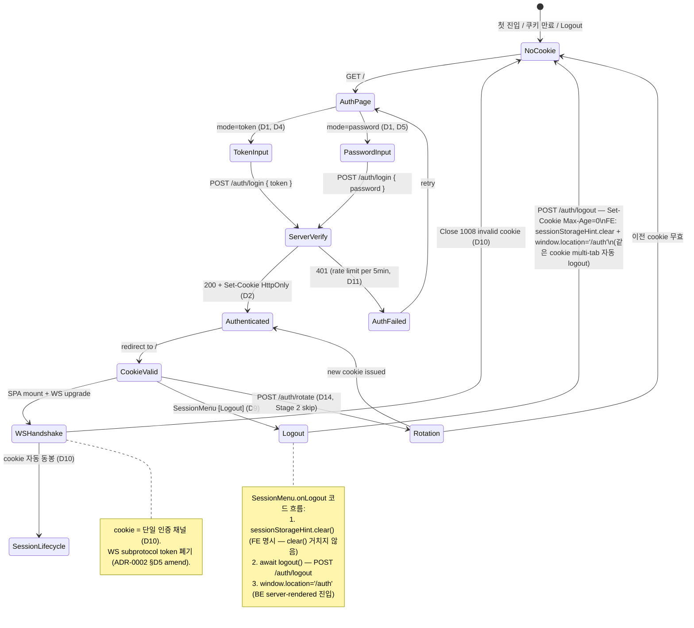
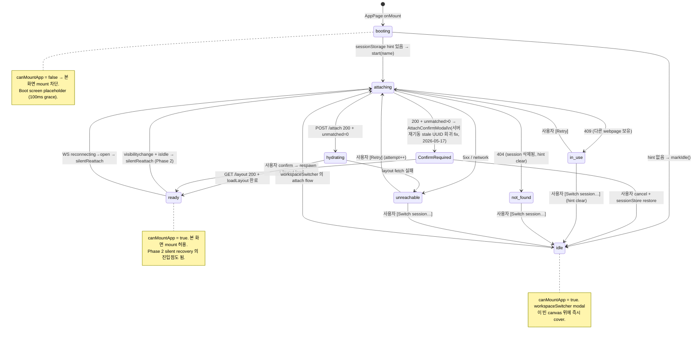
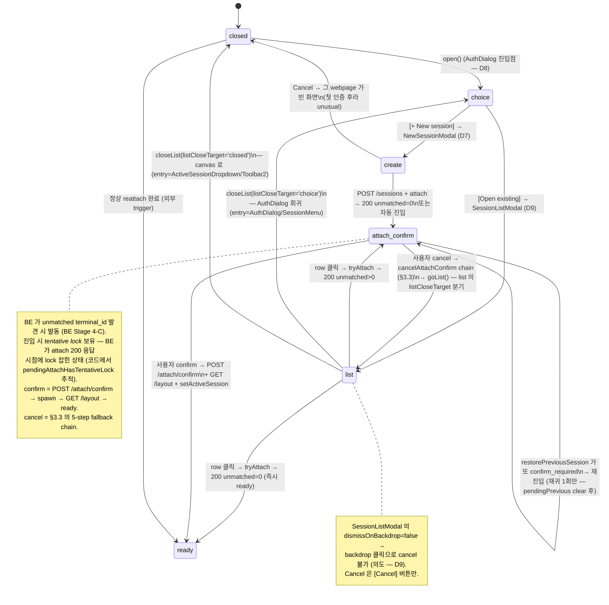
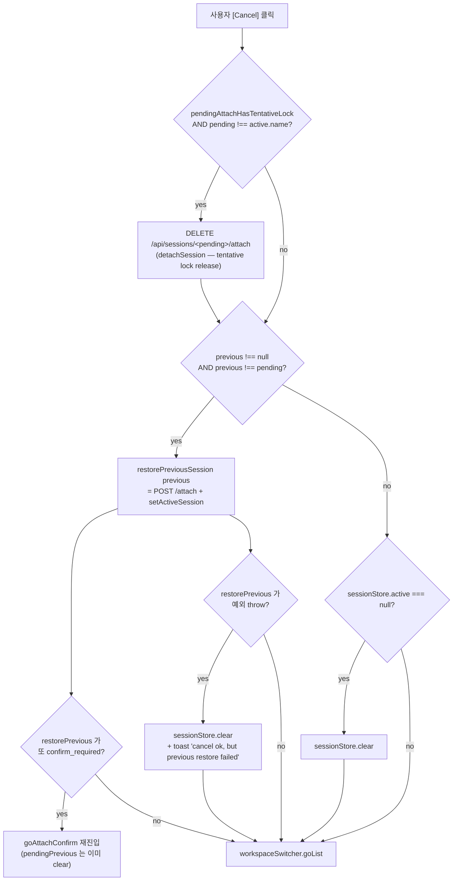
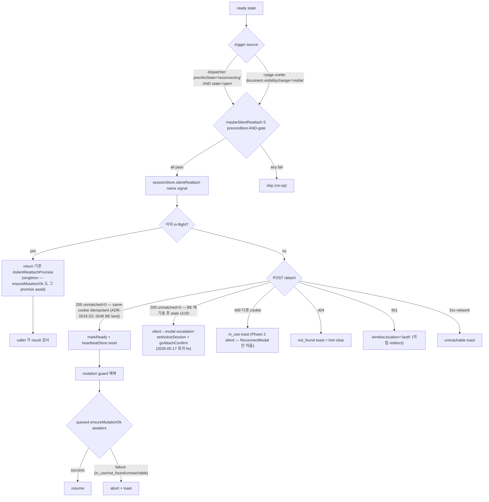
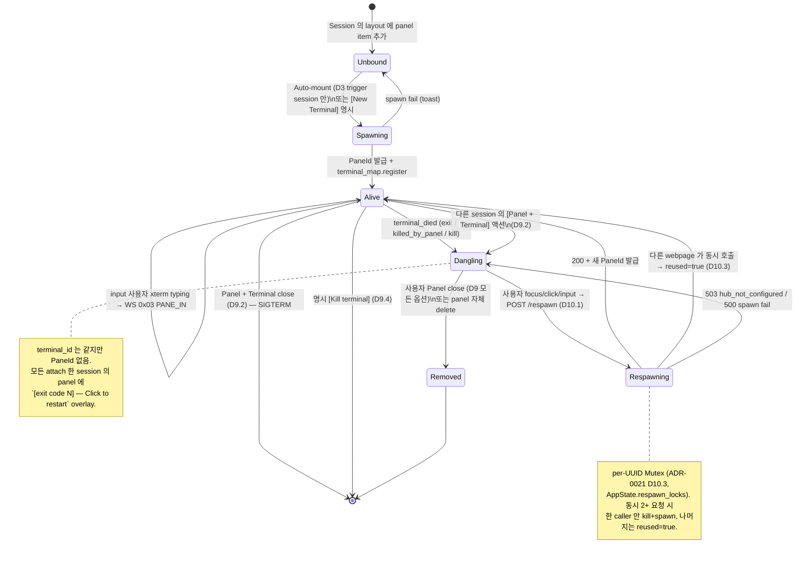
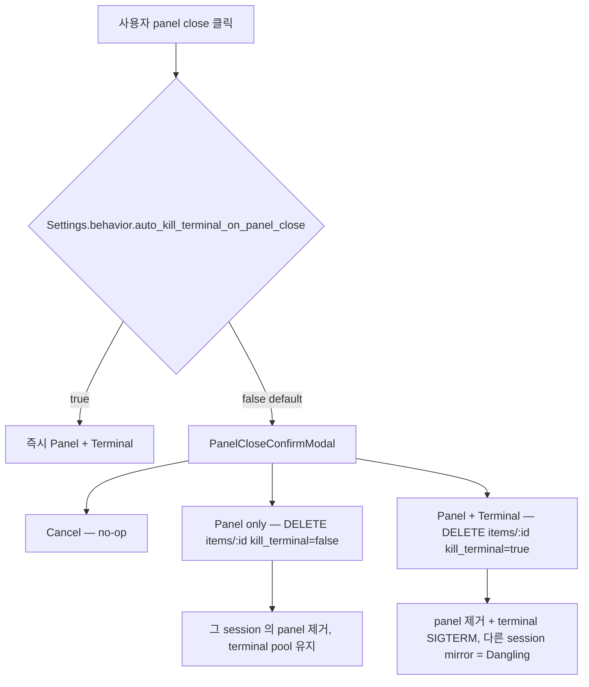
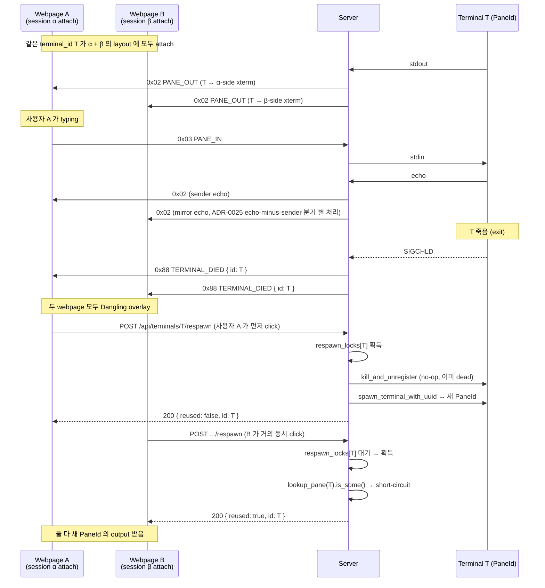

# State Machines — Auth / Session / Terminal

> SoT 문서. 본 doc 은 *cross-ADR 합성* — 결정 자체는 각 ADR 이 owner, 본 doc 은
> *3 차원 lifecycle (Auth / Session attach / Terminal connection) 의 통합
> 그래프 + UI 진입점 분기 + 예외/비정상 흐름* 을 mermaid 와 표로 정합. 작성
> 2026-05-18, 합쳐진 ADR 정본: 0019 (Session·Workspace) / 0020 (Auth Lifecycle)
> / 0021 (Terminal Pool·Mirror) / 0017 D6 (Shortcut hub) / 0030 (Clipboard).

---

## 1. 어휘 + 그래프 의도

| 어휘 | 정의 (CONTEXT.md 압축) |
|---|---|
| **Server** | 1 process · 1 port · 1 workspace 바인딩 (ADR-0019 D1, D11) |
| **Workspace** | server 와 1:1, storage dir (ADR-0019 D2) |
| **Session** | workspace 안 named file record (ADR-0019 D1) |
| **Webpage** | WS 연결, session 의 편집 채널 (Webpage : Session = 1:1, ADR-0019 D3) |
| **Terminal** | server-pool, multi-session 공유 가능 (Terminal : Panel = 1:N, ADR-0021 D1) |
| **PaneId** | terminal 의 backend-측 binding (lookup_pane 의 key) |
| **Cookie** | HttpOnly auth 토큰 (ADR-0020 D2). WS handshake 의 단일 인증 채널 (D10) |
| **flock + lease** | session 단위 cross-server / cross-webpage lock (ADR-0019 D6, ADR-0021 D6) |

본 doc 은 3 layer 를 분리한다:
1. **Auth lifecycle** (page 진입 ~ logout) — *cookie* 차원
2. **Session attach lifecycle** (cookie 통과 후 ~ webpage close) — *session lock + reconnectGate* 차원
3. **Terminal connection lifecycle** (panel mount ~ terminal kill) — *PaneId binding + multi-webpage mirror* 차원

세 layer 가 *수직 직교* — 한 layer 의 transition 이 다른 layer 의 state 를 직접 mutate 안 함 (단 비정상 close 시 cascade: auth fail → session detach → terminal binding 유지 / 단 multi-webpage mirror 만 유지).

---

## 2. Auth lifecycle (ADR-0020)

### 2.1 mermaid



### 2.2 State 정의

| State | 의미 | 진입 trigger | 이탈 trigger |
|---|---|---|---|
| `NoCookie` | 인증 cookie 없음 / 만료 / clear | 첫 진입, logout, cookie 만료, server cookie 회전 | `/auth` 진입 |
| `AuthPage` | `/auth` SPA 렌더링 (D13) | GET `/` 시 cookie 없으면 redirect | token / password 입력 후 POST |
| `TokenInput` / `PasswordInput` | 입력 form 표시 (D4 / D5) | mode 분기 (config `auth.mode`) | 사용자 submit |
| `ServerVerify` | BE 가 `/auth` POST 처리 (D8) | submit | 200 (정상) / 401 (실패) |
| `Authenticated` | cookie 발행 직후, redirect 직전 | 200 응답 | `/` redirect |
| `CookieValid` | cookie 유효 — 본 app 사용 중 | redirect 완료 | logout / cookie 만료 / rotation |
| `WSHandshake` | WS upgrade 진행 중 | SPA mount 시 `lib/ws/client.ts` | open 성공 / 1008 close |
| `Logout` | confirm modal → POST `/auth/logout` | SessionMenu [Logout] | NoCookie |
| `Rotation` | cookie 회전 (CLI `rotate-token` 또는 D14) | sysadmin action | NoCookie or new Authenticated |

---

## 3. Session attach lifecycle (ADR-0019)

본 layer 는 cookie 통과 후 webpage 가 어느 session 에 *attach* 하는지 +
*reconnect/recovery* 의 분기. **`reconnectGate` 8-state + `workspaceSwitcher`
5-stage 의 두 머신이 협조**한다.

### 3.1 mermaid — reconnectGate 8-state (page entry blocking, ADR-0019 D5.4)



### 3.2 mermaid — workspaceSwitcher 5-stage (modal stack)



### 3.2.1 `cancelAttachConfirm` 5-step fallback chain (ADR 미명시 — 코드 SoT)

`WorkspaceSwitcher.svelte:215~250` 의 cancel 흐름은 ADR-0019 D8 에 명시
없는 *실 코드 의도*. 핵심: **AttachConfirmModal cancel = "switch 시도
무효화" 의미** — tentative lock release + 이전 session 복귀.



→ **5 step**: (1) tentative lock release / (2) previous restore 시도 /
(3) recursive confirm_required 처리 / (4) failure fallback (clear + toast)
/ (5) `goList()` (= SessionListModal 로 복귀 — list 의 `listCloseTarget`
이 'choice' 면 AuthDialog, 'closed' 면 close).

### 3.3 listCloseTarget 분기 (UI entry-point 별 cancel 의미)

`SessionListModal` 의 cancel 동작은 *어떤 경로로 진입했는지* 에 따라 다르다. 이는
`workspaceSwitcher.listCloseTarget` 의 분기로 표현됨.

| Entry point | 진입 호출 | `listCloseTarget` | Cancel 시 routing |
|---|---|---|---|
| **AuthDialog** (인증 후 dialog, D8) | `workspaceSwitcher.open()` → `goList('choice')` | `'choice'` | AuthDialog (새/기존 선택) 으로 회귀 — 사용자는 빈 화면 안 봄 |
| **SessionMenu → "Switch session…"** | 같음 (`open()` 후 `goList('choice')`) | `'choice'` | AuthDialog 회귀 (이전 session 은 이미 detach) |
| **ActiveSessionDropdown 클릭** | 직접 `goList('closed')` | `'closed'` | 현 canvas 로 (현 active session 유지) |
| **Toolbar2 의 active session 버튼** (line 167) | 직접 `goList('closed')` | `'closed'` | 같음 |
| **ReconnectModal [Switch session…]** | `reconnectGate.cancel()` (state==='attaching' 분기에서 fire-and-forget `DELETE /api/sessions/{attemptName}/attach` 동봉 — ADR-0019 D5.4 amend ②) → `workspaceSwitcher.open()` → `goList('choice')` | `'choice'` | AuthDialog 회귀 (현 attempt 의 session 은 의도적 포기) |

→ `dismissOnBackdrop=false` (`SessionListModal.svelte:154`) 와 결합 시 *사용자가 의도 없이* modal 빠지는 경로 0. [Cancel] 버튼만 routing 가능.

### 3.4 Heartbeat + Silent reattach 진입점 (ADR-0019 D5.1, ADR-0021 D6/D6.1)



### 3.4.1 5 precondition 정확히 (`+page.svelte:148~157`)

`maybeSilentReattach` 의 AND-gate (한 개라도 false 면 no-op):

| # | Condition | 사유 |
|---|---|---|
| 1 | `typeof document !== 'undefined'` | SSR/test 가드 |
| 2 | `document.visibilityState === 'visible'` | 탭이 foreground (Case II 정의) |
| 3 | `reconnectGate.canMountApp === true` | (= `ready` ∨ `idle`) — booting/attaching 중에는 silent 진입 안 함 |
| 4 | `sessionStore.active !== null` | 아직 attach 안 한 webpage 는 무시 |
| 5 | `sessionStore.reattachInProgress === false` | 이미 silent 중이면 중복 안 함 |
| 6 | `heartbeatStore.isIdle === true` | 15s+ 사용자 무활동 (server frame 곧 흐를 가능성 낮음) |

→ ADR-0019 D5.1 의 "trigger 합집합" 은 2 가지만 명시 (visibility + WS
reconnecting→open). 코드는 *2 trigger × 6 precondition* 의 AND-gate.

### 3.4.2 `silentReattach` in-flight singleton (`sessionStore.ts:519~552`)

```
silentReattach(name, signal) →
  if (#silentReattachPromise !== null) return #silentReattachPromise;
  this.reattachInProgress = true;
  #silentReattachPromise = (async () => {
    try { return await this.attemptReattach(name, signal); }
    finally {
      this.reattachInProgress = false;
      this.#silentReattachPromise = null;
    }
  })();
  return #silentReattachPromise;
```

→ visibilitychange 와 WS reconnecting→open 이 *같은 tick* 에 발화해도 한
번만 실제 fetch. ensureMutationOk 도 이 promise 를 await (line 572-573) —
즉 mutation 진입점들이 silent reattach 결과를 *기다린 후* mutation 진행.

---

## 4. Terminal connection lifecycle (ADR-0021)

### 4.1 mermaid



### 4.2 Panel close 의 3-옵션 분기 (ADR-0021 D9.2)



### 4.3 multi-webpage Terminal mirror (ADR-0021 D1 + D10.3)



---

## 4.4 HTTP endpoint 매트릭스 (FE ↔ BE wire SoT)

본 doc 의 layer 별 호출 endpoint 정합:

| Endpoint | Method | 영향 layer | 주 호출처 | ADR |
|---|---|---|---|---|
| `/auth/login` | POST | Auth | `AuthPage` form submit | ADR-0020 D4/D5 |
| `/auth/logout` | POST | Auth | `SessionMenu.onLogout` | ADR-0020 D9 |
| `/auth/rotate` | POST | Auth | (Stage 2 skip) | ADR-0020 D14 |
| `/api/sessions` | GET | Session | `SessionListModal` 1s polling, `AuthDialog` | ADR-0019 D9 |
| `/api/sessions` | POST | Session | `NewSessionModal.onCreate` | ADR-0019 D7 |
| `/api/sessions/<name>` | DELETE | Session | SessionListModal kebab, SessionMenu "Delete current" | ADR-0019 D10/D10.1 |
| `/api/sessions/<name>/attach` | POST | Session | `tryAttach`, `attemptReattach`, `silentReattach`, `restorePreviousSession` | ADR-0019 D3 (+ 0046 same-cookie idempotent) |
| `/api/sessions/<name>/attach` | **DELETE** | Session | `cancelAttachConfirm` (tentative lock release), `ImportSessionModal` | **ADR 미명시 — 코드 SoT** |
| `/api/sessions/<name>/attach/confirm` | POST | Session/Terminal | `confirmAttach` (AttachConfirmModal 확정) | (BE Stage 4-C, ADR-0019 D8 의 일부) |
| `/api/sessions/<name>/layout` | GET / PUT | Session | `tryAttach` 후 fetch, mutation debounced PUT | ADR-0018 |
| `/api/sessions/<name>/items/<id>?kill_terminal=<bool>` | DELETE | Terminal | PanelCloseConfirmModal 의 [Panel only] / [Panel + Terminal] | ADR-0021 D9 |
| `/api/terminals` | GET | Terminal | TerminalListView 1s polling | ADR-0021 D7 |
| `/api/terminals/<id>/respawn` | POST | Terminal | PanelDanglingOverlay (자동 또는 명시 click) | ADR-0021 D10.1/D10.3 |
| `/api/terminals/<id>/kill` | POST | Terminal | TerminalListView 의 [Kill terminal] | ADR-0021 D9.4 |
| `/api/sessions/import` | POST | Session | ImportSessionModal (detach 후 import) | ADR-0029 |
| `/api/sessions/<name>/export` | GET | Session | ExportSessionModal | ADR-0029 |
| `/api/leave?webpage_id=<id>` | POST (sendBeacon) | Session | `beforeunload` best-effort → `navigator.sendBeacon`; body 없음, 204 No Content, idempotent. `release_lock_for_owner(owner_key)` 호출. | ADR-0021 D6 amend ② |
| `/api/shutdown` | POST | Server | ShutdownModal confirm | ADR-0014 |

### 4.4.1 ADR 미명시 endpoint — `DELETE /api/sessions/<name>/attach`

본 endpoint 는 ADR-0019 / 0020 / 0021 어디에도 명시 없음. 코드만이 SoT:

- **BE**: `crates/http-api/src/sessions.rs::detach_handler` (line 842), route
  wired at `lib.rs:621` `.delete(sessions::detach_handler)`. cookie-by-name
  basis 로 `session_locks_by_cookie` entry remove (= D5 의 ephemeral active
  flag false + flock release).
- **FE 사용처 2**:
  - `WorkspaceSwitcher.svelte:228` — **tentative lock release** in
    `cancelAttachConfirm`. attach 가 200 응답 (lock 잡힘) 후 unmatched>0 →
    AttachConfirmModal 진입 → 사용자 cancel → BE 에 명시 release 호출
    필요. 본 endpoint 가 그 역할.
  - `ImportSessionModal.svelte:202` — Import 흐름 시 현재 attached
    session 명시 detach (ADR-0029 영역).

→ ADR-0019 D8 에 amend 후보 — "attach 의 confirm_required cancel = 명시
detach" 패턴을 D8.1 같은 sub-section 으로 정합. 본 doc 의 §3.2.1 가 임시
SoT.

---

## 5. UI 분기 매트릭스 — 진입점 × 의도

### 5.1 SessionListModal 진입점 / cancel 의미 (= §3.3 재시각화)

| 진입점 | 코드 위치 | `listCloseTarget` | Cancel 후 | 의도 |
|---|---|---|---|---|
| AuthDialog "기존 session" | `WorkspaceSwitcher.svelte` `open() → goList('choice')` | `choice` | AuthDialog | 첫 인증 후 — *반드시* session 결정 필요 |
| SessionMenu "Switch session…" | 같음 | `choice` | AuthDialog | 의도적 session 변경 — 현 session detach 됨 |
| ActiveSessionDropdown | 직접 `goList('closed')` | `closed` | 현 canvas | 가벼운 봄/취소 — 현 session 유지 |
| Toolbar2 active session 버튼 | 같음 (line 167) | `closed` | 현 canvas | 같음 |
| ReconnectModal [Switch session…] | `reconnectGate.cancel()` (tentative `DELETE /attach` fire-and-forget — D5.4 amend ②) `→ open() → goList('choice')` | `choice` | AuthDialog | 의도적 reattach 포기 |

### 5.1.1 AttachConfirmModal entry 분기

AttachConfirmModal 은 *3 곳* 에서 진입 가능 — 진입 source 에 따라
`pendingAttachPreviousSession` / `pendingAttachHasTentativeLock` flag 값이
다르고, 그래서 cancel chain 동작도 다름:

| Entry source | 코드 위치 | `pendingPrevious` | `hasTentativeLock` | Cancel 후 |
|---|---|---|---|---|
| **tryAttach (사용자 명시 attach)** | `WorkspaceSwitcher.svelte:131-133` | 직전 active session | `true` | tentative detach + previous restore → goList |
| **silentReattach Phase 2 escalation** | `+page.svelte:173-174` | `null` (silent 진입엔 previous 개념 없음) | `false` | clear → goList |
| **reconnectGate Phase 1 escalation** | `reconnectGate.svelte.ts:#run` | `null` | `false` | clear → goList |

→ tryAttach 의 cancel 만 *5-step fallback chain* (§3.2.1) 전체 발동. 나머지
2 entry 는 *단순 cancel* (clear + goList).

### 5.2 Modal 의 `dismissOnBackdrop` 정책

| Modal | `dismissOnBackdrop` | 사유 |
|---|---|---|
| `SessionListModal` | **false** | session 결정은 의도 액션, 우발적 dismiss 위험 |
| `NewSessionModal` | **false** | 같음 |
| `AttachConfirmModal` | **false** | unmatched terminal respawn 결정 — 의도 |
| `PanelCloseConfirmModal` | **false** | destructive (terminal SIGTERM 가능) |
| `SessionDeleteConfirmModal` | **false** | destructive (session 영구 삭제) |
| `ShutdownModal` | **false** | destructive (server graceful shutdown) |
| `ReconnectModal` | **N/A** (always modal, no backdrop dismiss) | 본 화면 mount 차단 중 |
| `ImportSessionModal` / `ExportSessionModal` | **true** | 부수 액션 — 우발 dismiss OK |
| `FilePickerModal` | **true** | 같음 |

### 5.3 SessionDelete entry points (ADR-0019 D10.1)

| 진입점 | 조건 | Confirm 후 routing |
|---|---|---|
| **SessionListModal** `Available` row hover-kebab | row 가 본 webpage 의 active 가 아니고, 다른 webpage 의 in-use 도 아닐 때만 | `deleteSession()` → 1s polling (D6.4) 의 다음 tick row 자연 제거 |
| **SessionMenu** "Delete current session…" | 현 attached session 만 | `deleteSession(activeName)` → `sessionStore.clear()` + `reconnectGate.cancel()` + `sessionStorageHint.clear()` + `workspaceSwitcher.open()` (AuthDialog 회귀) |

---

## 6. 예외 / 비정상 흐름 매트릭스

### 6.1 Browser-side 예외

| 시나리오 | 영향 layer | 처리 |
|---|---|---|
| **새로고침 (F5 / Cmd+R)** | Session attach | sessionStorage hint 있으면 `reconnectGate.start(name)` (booting → attaching → hydrating → ready). 없으면 booting → idle → AuthDialog. 본 화면 mount 차단 보장 (canMountApp). |
| **탭 background 후 foreground** (D5.1) | Session attach | `document.visibilitychange === 'visible'` + `heartbeat.isIdle` (15s 무활동) 시 `silentReattach`. 사용자 perception 0 (modal 안 뜸). |
| **OS sleep / wake** | Transport + Session | WS `reconnecting → open` 전이 시 silentReattach trigger. (BE 30s heartbeat timeout 후라면 lock release 됨 → 200 idempotent 또는 409 lock_conflict.) |
| **Network blip** (수초) | Transport | `lib/ws/client.ts` 의 1s grace + exp backoff (1/2/4/8/16s, cap 30s). Recovered 시 silentReattach. |
| **Network drop (장기, > 30s)** | Session | BE heartbeat 30s timeout → flock release → active=false. 복귀 시 silentReattach 가 200 (다른 webpage 없음) 또는 409 (다른 webpage 가 그 사이 attach). |
| **Browser crash / OS kill** | Transport + Session | WS close frame 못 보냄. BE 30s timeout 으로 정리. 다음 webpage 진입 시 정상 흐름. |
| **탭 닫기 (정상)** | Transport | `beforeunload` → `navigator.sendBeacon('/api/leave')` (best-effort, ADR-0021 D6). BE 즉시 lock release. |
| **여러 탭 동시 운영** | Session | 각 탭 = 다른 session (D3). 같은 session 의 multi-attach 금지 — 두 번째 탭은 409 → SessionListModal disabled row + "in use" badge. |

### 6.2 Server-side 예외

| 시나리오 | 영향 layer | 처리 |
|---|---|---|
| **Server 재기동** | Auth + Session + Terminal | cookie 는 (storage 가 유지되면) 살아남음 → 새 WS open + silentReattach. 그러나 *terminal_id 모두 unmatched* — `attemptReattach` 가 `confirm_required` 반환 → AttachConfirmModal 진입 (서버 재기동 stale UUID 회귀 fix, 2026-05-17). 사용자 confirm 시 모두 respawn. |
| **Session [Delete] 도중 다른 webpage 가 attach 시도** | Session | 404 not_found → modal "Session 가 더 이상 존재하지 않음" + [Switch session…]. hint clear. |
| **Multi-webpage same-UUID respawn race** | Terminal | per-UUID `respawn_locks` Mutex → 한 caller 만 kill+spawn (`reused:false`), 나머지는 short-circuit (`reused:true`). UUID 당 alive PaneId 1 보장 (ADR-0021 D10.3). |
| **Terminal SIGTERM by 다른 session** | Terminal | TERMINAL_DIED broadcast → 모든 attach session 의 panel 에 Dangling overlay (D10 c2). 사용자 focus/click → respawn API. |
| **Server graceful shutdown (Cmd+Shift+Q)** | All | WS close 1011 broadcast + 모든 child SIGHUP + state dir flush. 각 webpage = ReconnectModal `unreachable` → retry → 결국 cookie 만료까지 NoCookie 로. |
| **Cookie 만료 / rotate** | Auth | WS handshake 시 1008 close → SPA 가 401 detect → `/auth` redirect. |

### 6.3 UI 비정상 진입 (의도 안 한 modal stack)

| 시나리오 | 차단 메커니즘 | 결과 |
|---|---|---|
| **Boot 직후 빈 canvas flash** | `reconnectGate.canMountApp` 게이트 — `booting/attaching/hydrating/in_use/not_found/unreachable` 동안 `<Canvas>` 차단. boot screen placeholder 또는 ReconnectModal mount. | flash 0 |
| **SessionListModal 의 backdrop 클릭으로 우발 cancel** | `dismissOnBackdrop=false` | 차단 — [Cancel] 버튼만 routing |
| **AttachConfirmModal 도중 사용자가 다른 session 클릭** | modal mount 시 `escRouter` priority chain 가 modal stack top 우선 — 다른 chrome 액션 차단 | 차단 |
| **Multi-tab 의 같은 session 진입 시도** | D3 single-attach → 두 번째 탭은 409 → "in use" badge | 차단 + 사용자 분명 noticed |
| **SessionListModal 에서 active row 클릭** | row 는 `disabled` (50% opacity + tooltip) — 본 webpage 의 active 가 아니라 *다른 webpage 가 attach 한* row | 차단 |
| **`Cmd+W` 로 탭 우발 close** | browser default — `beforeunload` 의 sendBeacon 으로 BE 즉시 lock release | 그 webpage 만 영향, 다른 탭 unchanged |
| **silentReattach 진행 중 mutation 시도** | `ensureMutationOk('...')` guard — 7+ entry point (Canvas / TextNode / PanelNode / PanelDanglingOverlay / LayerTreeView / TerminalListView / zStore). reattach 결과 검사 후 진행 / abort | reattach fail 시 toast + abort, success 시 resume |
| **AttachConfirmModal 의 cancel 후 active session 잃음** | §3.2.1 5-step fallback chain: tentative `DELETE /attach` → `restorePreviousSession` (이전 session 재attach, recursive confirm_required 처리) → 실패 시 `sessionStore.clear()` + 8s toast → `workspaceSwitcher.goList()` (= SessionListModal 복귀, listCloseTarget 분기) | 가능 한 한 직전 상태 복귀, 실패 시도 *작업 손실 0* (session file 영속) |
| **silent reattach 결과를 mutation 진입점이 모름** | `ensureMutationOk(msg?)` helper 가 `#silentReattachPromise` 를 await 후 result 검사. success 면 mutation 진행, fail 이면 toast + abort. 7+ entry point (Canvas / TextNode / PanelNode / PanelDanglingOverlay / LayerTreeView / TerminalListView / zStore) 일관화 | mutation race 차단 |
| **두 trigger (visibility + WS reconnecting→open) 가 같은 tick 발화** | `#silentReattachPromise` singleton — 두 번째 호출은 같은 promise 반환 (fetch 1번만) | 중복 fetch 0 |
| **silent reattach 중 BE 재기동된 case (stale UUID)** | `confirm_required` 반환 → `setActiveSession + workspaceSwitcher.goAttachConfirm` 으로 silent→modal escalation (2026-05-17 회귀 fix). 사용자가 panel 만 남고 respawn 없는 상태로 빠지던 버그 차단 | modal 진입 후 사용자 confirm 또는 cancel |

---

## 7. ADR cross-reference 표

| Layer | ADR / decision | 본 doc section |
|---|---|---|
| Auth mode (token/password) | ADR-0020 D1, D4, D5, D8, D13 | §2 |
| Cookie lifecycle | ADR-0020 D2, D3, D14 | §2 |
| Logout / multi-tab | ADR-0020 D9 | §2 |
| WS auth (cookie 단일) | ADR-0020 D10 | §2 |
| Server : Workspace : Session 모델 | ADR-0019 D1, D2, D11 | §1 |
| Single-attach reciprocal | ADR-0019 D3 + D4 | §3.1, §6.1 |
| Session lifecycle (file + ephemeral) | ADR-0019 D5 | §3 |
| Idle reconnect silent | ADR-0019 D5.1 | §3.4 |
| Mutation guard | ADR-0019 D5.2 | §3.4, §6.3 |
| 결정 매트릭스 8 시나리오 | ADR-0019 D5.3 | §6.1 |
| Initial entry blocking (reconnectGate) | ADR-0019 D5.4 | §3.1 |
| Cross-server session lock | ADR-0019 D6 (flock+lease) | §3.4, §6.2 |
| 새 session modal | ADR-0019 D7 | §3.2 |
| 인증 후 dialog | ADR-0019 D8 | §3.2 |
| Session list modal (1s polling) | ADR-0019 D9 | §3.2, §3.3 |
| Session delete cascade + entry points | ADR-0019 D10 + D10.1 | §5.3 |
| Terminal multi-mirror | ADR-0021 D1, D2 | §4.1, §4.3 |
| Auto-mount trigger session 만 | ADR-0021 D3 | §4.1 |
| Heartbeat 15s/30s | ADR-0021 D6 + D6.1 + D6.2 | §3.4, §6.1, §6.2 |
| Panel close 3-옵션 | ADR-0021 D9.1~D9.4 | §4.2 |
| Cross-session terminal_died | ADR-0021 D10 | §4.1, §6.2 |
| Lazy fresh spawn | ADR-0021 D10.1 + D10.2 | §4.1 |
| Respawn per-UUID lock | ADR-0021 D10.3 | §4.3, §6.2 |
| 단축키 (P0 기본 편집) | ADR-0017 D6 amend ⑤ | (out of scope) |
| Clipboard | ADR-0030 | (out of scope) |
| Undo/Redo | ADR-0028 | (out of scope) |

---

## 7.1 ADR 미명시 — 코드 SoT 흐름 (2026-05-18 amend 추가)

본 doc 최초 작성은 ADR 중심이었음. 코드 정밀 read (2026-05-18) 로 발견한
*ADR 어디에도 명시 없는* 흐름들 — 본 doc 의 *임시* SoT 로 채택 후 ADR
amend 진행 (2026-05-18). 현 상태:

| 흐름 | 코드 SoT 위치 | 본 doc 위치 | ADR 상태 |
|---|---|---|---|
| **`DELETE /api/sessions/<name>/attach`** endpoint (명시 lock release) | `sessions.rs:842 detach_handler`, FE `WorkspaceSwitcher:228` | §4.4.1 | ✅ **ADR-0019 D5.5 line 296** (별 amend 가 이미 명시) |
| **Tentative lock 패턴** (attach 200 후 confirm 전) | `WorkspaceSwitcher:116-117, 131-133` (`pendingAttachHasTentativeLock` flag) | §3.2.1, §5.1.1 | ✅ **ADR-0019 D5.5** (별 amend 가 이미 *tentative attach* 개념 정의) |
| **`cancelAttachConfirm` 5-step fallback** | `WorkspaceSwitcher:215-250` | §3.2.1 | ✅ **ADR-0019 D5.5.1 신규** (2026-05-18 amend, 본 turn) |
| **`restorePreviousSession` 의 recursive confirm_required** | `WorkspaceSwitcher:193-213` | §3.2.1 의 mermaid 분기 J | ✅ **ADR-0019 D5.5.1 표 step 3** (2026-05-18 amend) |
| **`silentReattach` → `AttachConfirmModal` escalation** | `+page.svelte:169-176` (2026-05-17 회귀 fix) | §3.4, §6.3 | ✅ **ADR-0019 D5.1 amend ② (`200 + unmatched>0` 분기)** (2026-05-18 amend) |
| **`maybeSilentReattach` 의 6 precondition AND-gate** | `+page.svelte:148-157` | §3.4.1 | ✅ **ADR-0019 D5.1 amend ② (Pre-condition 6-row)** (2026-05-18 amend) |
| **`#silentReattachPromise` in-flight singleton** | `sessionStore.ts:519-552` | §3.4.2 | ✅ **ADR-0019 D5.2.1 신규** (2026-05-18 amend) |
| **`ensureMutationOk` 가 silent promise await** | `sessionStore.ts:572-573, 822` | §3.4.2 | ✅ **ADR-0019 D5.2 본문** (2026-05-18 amend, ensureMutationOk helper 명시) |
| **AttachConfirmModal 의 3 entry source** (tryAttach / silent / reconnectGate) | `WorkspaceSwitcher:131-133`, `+page.svelte:174`, `reconnectGate:#run` | §5.1.1 | ✅ **ADR-0019 D5.5.2 신규** (2026-05-18 amend) |
| **`SessionMenu.onLogout` 의 sessionStorageHint 명시 clear** | `SessionMenu.svelte:32-44` | §2 mermaid note | ✅ **ADR-0020 D9.1 신규** (2026-05-18 amend) |
| **`POST /auth/login` body 형식** (실제는 form-encoded vs JSON?) | `auth.ts:35-95` | §2 mermaid | 🟨 **deferred** — endpoint 자체는 ADR-0020 D4/D5 에 명시, body 형식 (form vs JSON) 의 wire 디테일은 별 ADR amend 후보 |

---

## 8. 후속 / open

- **Marquee selection** (canvas drag-rectangle 선택) — UI 측 selection 의 별 entry. 현 SoT 없음 — 별 ADR 후보.
- **Command palette (Cmd+K)** — TBD (ADR-0017 D6 amend ⑤ 의 P2 deferred 와 Find 와 분기).
- **WS subprotocol 의 보조 (deep-link `?session=<name>`)** — ADR-0020 D6 의 P1+ 영역. 본 doc 의 §3.2 closed → choice → list 의 *우회 entry* 가 될 수 있음 — land 시 §3.2 amend.
- **Terminal pool 의 별 attach UI** (TerminalListView 의 [Attach to this session]) — §4 의 `Unbound → Spawning` 의 *대안 경로* (= 새 panel 만들고 기존 terminal binding). 별 sub-flow ADR-0021 D7/D8 참조.

---

## 변경 이력

- **2026-05-18**: 초안. ADR-0019 / 0020 / 0021 / 0017 D6 / 0030 / 0028 의 합성. reconnectGate 8-state + workspaceSwitcher 5-stage + Terminal 6-state 의 3 mermaid + listCloseTarget 분기 + dismissOnBackdrop 정책 + 6.1/6.2/6.3 의 21 예외 시나리오. 코드 cross-link: `lib/stores/{reconnectGate,workspaceSwitcher,sessionStore,sessionStorageHint}.svelte.ts` + `lib/chrome/{SessionListModal,WorkspaceSwitcher,ReconnectModal,SessionMenu}.svelte` + `lib/ws/{client,heartbeat,dispatcher}.svelte.ts`.
- **2026-05-18 (0073 FE-A land)**: §3.3 + §5.1 의 *ReconnectModal [Switch session…]* row 에 `reconnectGate.cancel()` 의 fire-and-forget `DELETE /attach` 동봉 명시. ADR-0019 D5.4 amend ② 짝. 0071 §B-1 의 tentative lock leak 해소.
- **2026-05-18 (mermaid fix)**: §3.4 + §4.2 flowchart 의 unquoted node text (slash 시작 = parallelogram shape 충돌, decision 안 dot/slash, edge label `<br/>` + unicode arrow) 해소 — 모든 node text 와 decision `{...}` 를 quote `"..."` 로 감쌈.
- **2026-05-18 (코드 정밀 read 합본 — ADR 미명시 흐름 amend)**: 코드 정밀 read 로 ADR 어디에도 명시 없는 흐름 11종 발견 → 본 doc 의 *임시 SoT* 로 채택. 신규/amend:
  - §2 Auth mermaid — endpoint 정확화 (`POST /auth/login` / `POST /auth/logout` / `POST /auth/rotate` Stage 2 skip). `SessionMenu.onLogout` 의 3-step 흐름 note (sessionStorageHint.clear + logout + window.location).
  - §3.2 workspaceSwitcher mermaid — `attach_confirm` cancel 의 진실 transition `→ list` (closed 아님). recursive `confirm_required` self-loop 추가. tentative lock 개념 note 추가.
  - **§3.2.1 신규** — `cancelAttachConfirm` 5-step fallback chain mermaid (tentative `DELETE /attach` → restore previous → recursive confirm_required → failure fallback → goList).
  - §3.4 silentReattach flowchart 전면 재구성 — trigger 2 source + 5 precondition AND-gate + in-flight singleton 분기 + silent→modal escalation (confirm_required 분기 신규) + 401 직접 redirect.
  - **§3.4.1 신규** — `maybeSilentReattach` 의 6 precondition 표.
  - **§3.4.2 신규** — `#silentReattachPromise` in-flight singleton 코드 + ensureMutationOk 의 await 흐름.
  - **§4.4 신규** — HTTP endpoint 매트릭스 (17 endpoint × layer × ADR 매핑).
  - **§4.4.1 신규** — ADR 미명시 `DELETE /api/sessions/<name>/attach` endpoint 의 BE/FE 사용처 명시.
  - **§5.1.1 신규** — AttachConfirmModal 의 3 entry source 표 (tryAttach / silent / reconnectGate) — entry 별 cancel chain 차이.
  - §6.3 보강 4 row — AttachConfirmModal cancel 의 정확한 5-step chain / mutation 진입점이 silent 결과 모르는 케이스 (ensureMutationOk) / 두 trigger 같은 tick race / silent → modal escalation.
  - **§7.1 신규** — ADR 미명시 흐름 11종 표 + ADR amend 후보 cross-link (ADR-0019 D5.1 amend ② / D5.2 동작 디테일 / D8.1 신규 신청 / ADR-0020 D9 FE 흐름 명시).
  - 코드 cross-link 추가: `lib/http/{auth,sessions}.ts`, `+page.svelte:148-157, 169-176`, `WorkspaceSwitcher.svelte:86-250`, `sessionStore.ts:519-552, 572-573`, `SessionMenu.svelte:32-103`, `sessions.rs:842 detach_handler`.
